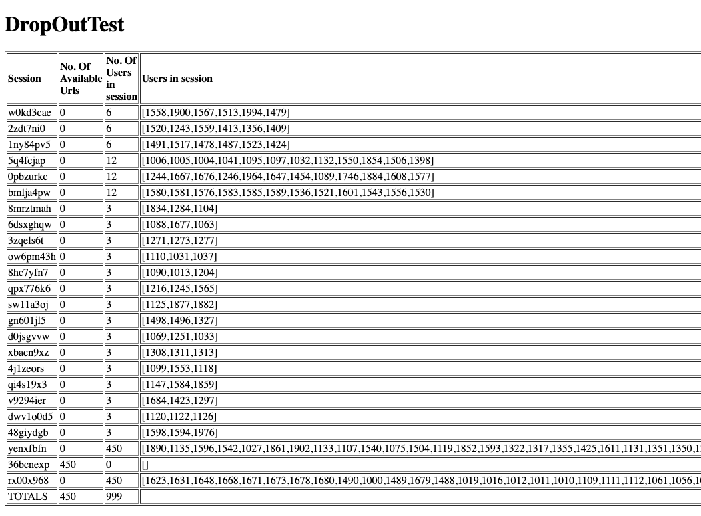
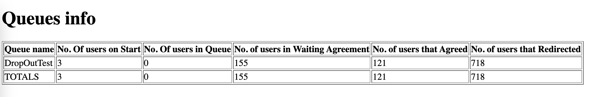

# otree-waiting-room

## Setup docker environment

Run multiple otree servers using docker compose. follow [setup](https://github.com/obeliss-nlesc/otree-docker).

## Download sources

Pull master from github

```shell
git clone https://github.com/obeliss-nlesc/otree-waiting-room.git
```

## Install dependencies

The server runs on node version 20 or greater. Check your node version:

```shell
node -v
```

To install package dependencies

```shell
npm install
```

## Setup .env

If using Docker ([Docker setup](https://github.com/obeliss-nlesc/otree-docker)) development environment, then run

```shell
node set_env.js > .env
```

to set the .env file. The script will scan the local docker images to get the IPs of the containers.

In other cases the .env file needs to be setup manually as an example like so:

```shell
POSTGRES_IPS=192.168.0.1,192.168.0.2,192.168.0.3
OTREE_IPS=192.168.0.1,192.168.0.2,192.168.0.3
POSTGRES_USER=some_user
POSTGRES_DB=some_db
POSTGRES_PASSWORD=somepassword
OTREE_REST_KEY=somepassword
SECRET_KEY="some secret in quotes"
API_KEY="some other secret in quotes"
URL_PASS="some SHA256 hashed secret in quotes"
```

- `POSTGRES_IPS`: The POSTGRES server IPs comma separated.
- `OTREE_IPS`: The OTREE server IPs comma separated.
- `POSTGRES_USER`: The POSTGRES database username.
- `POSTGRES_DB`: The POSTGRES database name used by oTree.
- `POSTGRES_PASSWORD`: The POSTGRES user password.
- `OTREE_REST_KEY`: The oTree REST KEY to access the oTree API.
- `SECRET_KEY`: A secret key used to generate a waiting room URL signiture token.
- `API_KEY`: An API key to access the admin REST API for the waiting room.
- `URL_PASS`: A password used to access the waiting room info/helper pages. This password is created using the helper script `create-url-password-hash.js`

## Setup experiments config.json file

The Server needs to know some details of the oTree experiments being hosted on the servers.
These details are defined in a config.json file. An example is given below:

```json
{
  "experiments": [
    {
      "name": "guess_two_thirds",
      "enabled": false,
      "scheduler": {
        "type": "GatScheduler",
        "params": {
          "min": "3"
        }
      }
    },
    {
      "name": "public_goods_game",
      "enabled": true,
      "agreementTimeout": 10,
      "scheduler": {
        "type": "GatScheduler",
        "params": {
          "min": "3"
        }
      }
    }
  ]
}
```

In the above two experiments are setup. `name` is the oTree given name of the experiment.
`enabled` signals to the waiting-room to ignore and hence to not schedule the experiment.
`agreementTimeout` is the timeout shown on the AGREE webpage.
`scheduler` is what type of grouping scheduler to use. `GatScheduler` is the default
Group by Arrival Time scheduler i.e. it will group people on a first come first serve bases.
`params` are the scheduler specific parameters. In this case the GatScheduler only takes 1 parameter:
`min` the number of people to group. Save this file as as a json file e.g. `config.json`

## File database

By default the waiting room will save user details in a sqlite file database `data/userdb.sqlite`.
A different file can be passed as a parameter using `--db-file` option when starting the server.
The database stores the used urls i.e. urls that have alreaddy been used by a user.
On restarting the server waiting room, these urls are removed from the list of available urls so that
you would not redirect two or more users to the same url. To reset the database either delete the file
while the server is down or start the server with `--reset-db` flag.

## Start waiting room

To start server on a default port 8060 localhost

```shell
node server.js --port 8080 --config [PATH TO CONFIG.JSON]
```

A database is created by default in ./data/userdb.json which will save previous redirected urls. To reset the database
start the server with --reset-db flag.

## Generate test URLs

Use the helper URL path to generate tests URLS:

```
http://localhost:8060/urls/[EXPIMENT_NAME]/[NO_OF_URLS]?secret=[SECRET_USED_IN_URL_PASS]
```

Or use the encode-url.js helper script to generate test urls.

```shell
node encode-url.js -n 5 -h localhost:8080
```

## Query oTree servers

To list the URLs on the oTree servers use the helper tool `sessions.js`

### List experiment urls

```shell
node sessions.js list [NAME]
```

### List experiment sessions

```shell
node sessions.js list [NAME] --sessions
```

### Count experiment URLs

```shell
node sessions.js list [NAME] --count
```

## Create experiment sessions

To create session URLs for an experiment use the helper command `sessions.js`

### Create session with N participants

```shell
node sessions.js create [NAME] --num [NUM OF PARTICIPANTS]
```

## Simple info dashboard

The server comes with a simple info pages:

- sessions: showing the number of available URLs, number of users and user ids per session. The info page is accessed through the following path:

```
http://localhost:8060/info/sessions/[EXPERIMENT_NAME]?secret=[SECRET_USED_IN_URL_PASS]
```

E.g. for Experiment `DropOutTest`


- queues: show the queues status of the different experiments including the number of users on the start page, queued, waiting, agreed, and redirected.

```
http://localhost:8060/info/queues?secret=[SECRET_USED_IN_URL_PASS]
```

E.g. 

## Starting the server using PM2

To manage the server with pm2, first install pm2

```shell
npm install pm2 -g
pm2 start server.js -- --port 8080 --config [PATH TO CONFIG.JSON FILE]
pm2 list
```

To restart the server

```shell
pm2 restart server
```

## API documentation

API endpoints are documented using Postman and can be found [here](https://documenter.getpostman.com/view/1612141/2s9YeG7Bqm).
API endpoints have a pre-request script [postman-rest-pre-request-script.js](postman-rest-pre-request-script.js) that is added to all admin endpoints. For the script to run you have to add a Postman environment variable 'apiKey' with the value taken from the .env file generated earlier.
